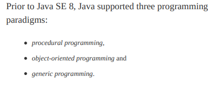
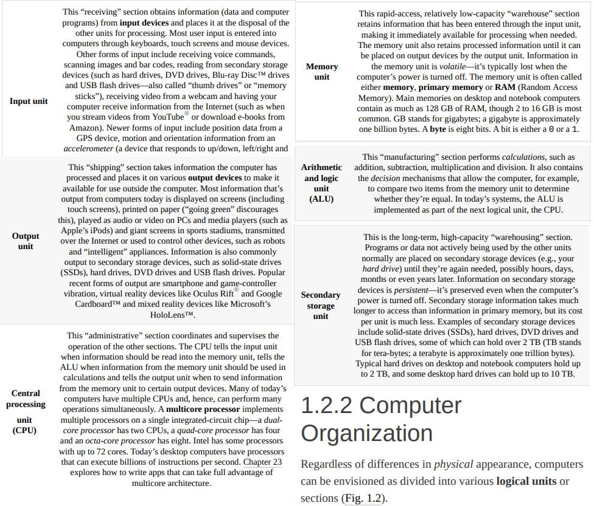
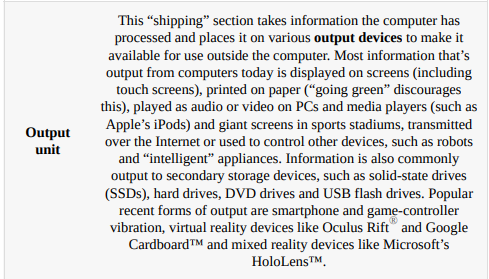

# Chapter 1

Computer Organization  
  
  
 Os computadores processam dados sob o controle de conjuntos de instruções chamados ________.  
b) As principais unidades lógicas do computador são ________, ________, ________, ________, ________ e ________.  
c) Os três tipos de linguagens discutidas no capítulo são ________, ________ e ________.  
d) Os programas que traduzem programas de linguagem de alto nível em linguagem de máquina são chamados ________.  
e) ________ é um sistema operacional para dispositivos móveis baseados no kernel do Linux e Java.  
f) O software ________ em geral tem todos os recursos, sendo (supostamente) livre de erros e pronto para uso pela comunidade.  
g) O Wii Remote, bem como muitos smartphones, usa um(a) ________ que permite ao dispositivo responder ao movimento.  

**1.2 Preencha as lacunas em cada uma das seguintes frases sobre o ambiente Java:**  
a) O comando ________ do JDK executa um aplicativo Java.  
b) O comando ________ do JDK compila um programa Java.  
c) Um arquivo de código-fonte aberto Java deve terminar com a extensão ________.  
d) Quando um programa Java é compilado, o arquivo produzido pelo compilador termina com a extensão ________.  
e) O arquivo produzido pelo compilador Java contém ________, que são executados pela Java Virtual Machine.  

**1.3 Preencha as lacunas de cada uma das sentenças a seguir (com base na Seção 1.5):**  
a) Os objetos permitem a prática de ________ — embora eles possam se comunicar entre si por meio de interfaces bem definidas, nor-
malmente não têm autorização para descobrir como outros objetos são implementados.  
b) Os programadores Java concentram-se na criação de ________, que contêm campos e o conjunto de métodos que manipulam essescampos, além de fornecer serviços para clientes.  
c) O processo de analisar e projetar um sistema de um ponto de vista orientado a objetos é chamado ________.  
d) Uma nova classe de objetos pode ser convenientemente criada por ________ — a nova classe (chamada subclasse) começa com as
características de uma classe existente (chamada superclasse), personalizando-as e talvez adicionando características próprias.  
e) _e_ é uma linguagem gráfica que permite às pessoas que projetam sistemas de software utilizar uma notação padrão da indús-
tria para representá-las.  
f) O tamanho, forma, cor e peso de um objeto são considerados _f_ da classe dele  

**1.4 Preencha as lacunas em cada uma das seguintes afirmações:**  
a) A unidade lógica que recebe informações de fora do computador para uso por ele é a ________.  
b) O processo de instrução do computador para resolver um problema específico é chamado ________.  
c) ________ é um tipo de linguagem de computador que utiliza abreviações em inglês para instruções de linguagem de máquina.  
d) ________ é uma unidade lógica que envia informações que já foram processadas pelo computador para vários dispositivos, de modo
que possam ser utilizadas fora da máquina.  
e) ________ e ________ são unidades lógicas do computador que retêm informações.  
f) ________ é uma unidade lógica do computador que realiza cálculos.  
g) ________ é uma unidade lógica do computador que toma decisões lógicas.  
h) As linguagens mais convenientes para que o programador escreva programas rápida e facilmente são as ________.  
i) A única linguagem que um computador pode entender diretamente é a ________ dele.  
j) ________ é uma unidade lógica do computador que coordena as atividades de todas as outras unidades lógicas.  
**1.5 Preencha as lacunas em cada uma das seguintes afirmações:**  
a) A linguagem de programação ________ é agora utilizada para desenvolver aplicativos corporativos de grande porte, aprimorar a
funcionalidade de servidores da web, fornecer aplicativos a dispositivos de consumo popular e para muitos outros propósitos.  
b) Inicialmente, o ________ tornou-se muito conhecido como a linguagem de desenvolvimento do sistema operacional UNIX.  
c) O ________ garante que as mensagens, que consistem em partes sequencialmente numeradas chamadas bytes, sejam adequadamente encaminhadas do emissor para o receptor, cheguem intactas e sejam montadas na ordem correta.  
d) A linguagem de programação ________ foi desenvolvida por Bjarne Stroustrup no início dos anos 1980 na Bell Laboratories.  

**1.6 Preencha as lacunas em cada uma das seguintes afirmações:**
a) Os programas Java normalmente passam por cinco fases: ________, ________, ________, ________ e ________.  
b) Um(a) ________ fornece muitas ferramentas que suportam o processo de desenvolvimento de software, como editores para escrever
e editar programas, depuradores a fim de localizar erros de lógica em programas e muitos outros recursos.  
c) O comando java invoca ________, que executa programas Java.  
d) Um(a) ________ é um aplicativo de software que simula um computador, mas oculta o sistema operacional e o hardware subjacentes
dos programas que interagem com ela(e).  
e) O ________ transfere os arquivos .class contendo os bytecodes do programa para a memória principal.  
f) O ________ examina bytecodes para assegurar que eles são válidos.  

**1.7 Explique as duas fases de compilação de programas Java.**  

**1.8
Um dos objetos mais comuns do mundo é um relógio de pulso. Discuta como cada um dos seguintes termos e conceitos se aplicam à no-
ção de um relógio: objeto, atributos, comportamentos, classe, herança (considere, por exemplo, o alarme dele), modelagem, mensagens,
encapsulamento, interface e ocultamento de informações.**  
